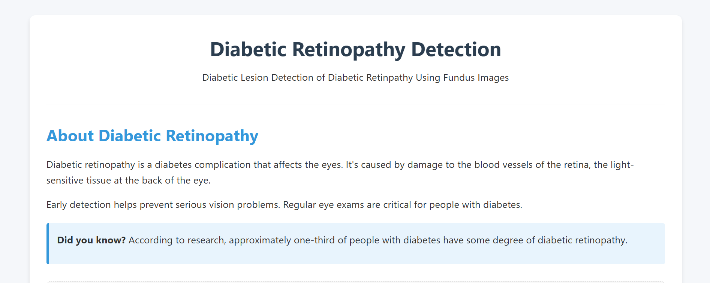
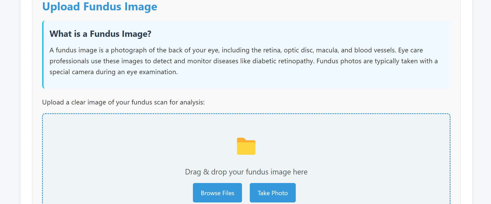
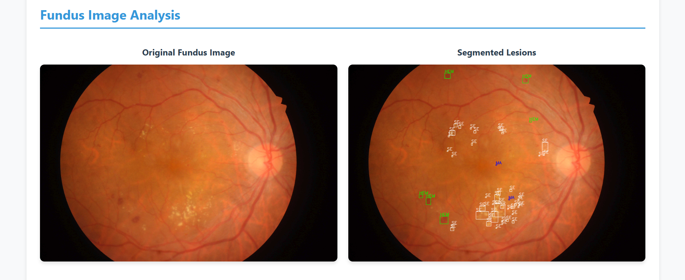
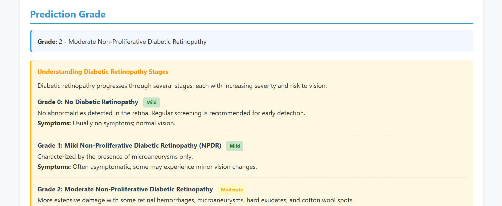
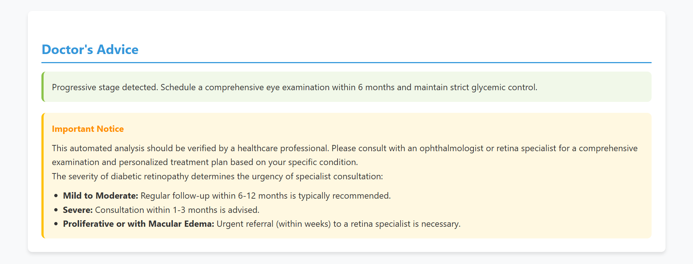
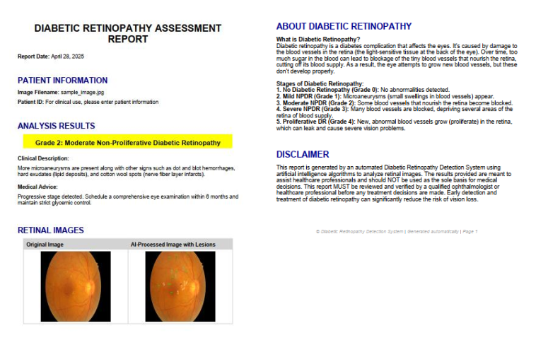

# Diabetic Lesion Detection in Diabetic Retinopathy Using Fundus Images

## 🧠 Project Summary

This project presents an AI-powered deep learning pipeline that detects and classifies diabetic lesions (microaneurysms, hemorrhages, and exudates) in retinal fundus images to assist in early diagnosis of Diabetic Retinopathy (DR). Leveraging Vision Transformers and UNet, it provides high accuracy for both classification and lesion-level segmentation.

---

## 🩺 Motivation

Manual diagnosis of DR via fundus images is time-consuming, expertise-dependent, and often unavailable in rural settings. We aim to develop a robust, scalable, and interpretable deep learning model that aids ophthalmologists in clinical and remote environments.

---

## 🔧 Tech Stack

- **Languages**: Python, Dart
- **Frameworks**: PyTorch, TensorFlow, Keras, Flask, Flutter
- **Models**: Vision Transformer (ViT), UNet, EfficientNet, ResNet, YOLOv8
- **Deployment Tools**: Flask API, Flutter frontend

---

## 📊 Datasets Used

- **APTOS 2019**
- **IDRiD**

> Augmentation expanded dataset size to 50,000+ samples for training.

---

## 🚀 Project Structure

- **Classification** using ViT (Severity Levels: 0–4)
- **Segmentation** using UNet (Lesion Types: MA, HEM, SE, EX)
- **Backend**: Python & Hugging face API for inference
- **Frontend**: Flask app for user upload & result display

---

## 📈 Results

| Model           | Accuracy | Precision | Recall | F1-Score |
|----------------|----------|-----------|--------|----------|
| ViT            | 91%      | 0.85      | 0.82   | 0.83     |
| ResNet50       | 84%      | 0.82      | 0.77   | 0.79     |
| UNet (Lesions) | 74% IoU  | Varies    | Varies | Varies   |

---

📦 Model Access
Due to the large size of the deep learning models used in this project (ViT, UNet, EfficientNet), they are not included in this repository directly.

👉 All pre-trained models, weights, and inference configurations are available on Hugging Face:
🔗 [Visit Hugging Face Model Hub](https://huggingface.co/spaces/doomslayer1434/DR_DISEASE_DETECTION/tree/main)

## 📷 Sample Outputs

---

## 📱 Frontend

- Upload fundus image
- View DR severity and lesion map
- Lightweight and easy-to-use interface

---

## 🔍 Future Scope

- Real-time mobile deployment
- Offline inference capabilities
- Larger, diverse datasets for better generalization

---

## 👨‍💻 Authors

- Mohammad Aqeel Memon – [211721]
- Mohammed Irfan Siddiqui – [211751]
- **Kaif Nasim Tokare** – [211755]

Supervisor: **Prof. Faiz Rangari**  
College: M.H. Saboo Siddik College of Engineering

---

## 📄 License

This project is licensed under the MIT License - see the [LICENSE](LICENSE) file for details.
